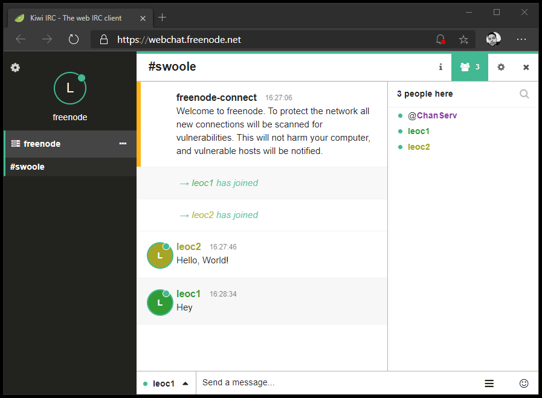

## Freenode Chat Example

```php
Co\run(static function (): void {
    $on_message = static function (Reply $reply): void {
        echo $reply->message, PHP_EOL;
    };

    $client = Client::withHandler(CallbackHandler::reply($on_message))
        ->connect('chat.freenode.net', 6667);

    $client->start();

    while (true) {
        $ln = trim(fgets(STDIN));

        if ($ln === '/q') {
            $client->quit();
            Co::suspend();
        }

        $client->writeln($ln);
    }
});
```

```text
$ php examples/freenode/chat.php

USER leocavalcante . . :real Leo Cavalcante
NICK leoc2
:card.freenode.net NOTICE * :*** Looking up your hostname...
:card.freenode.net NOTICE * :*** Checking Ident
:card.freenode.net NOTICE * :*** Couldn't look up your hostname
:card.freenode.net NOTICE * :*** No Ident response
JOIN #swoole
:card.freenode.net 001 leoc2 :Welcome to the freenode Internet Relay Chat Network leoc2
:card.freenode.net 002 leoc2 :Your host is card.freenode.net[38.229.70.22/6667], running version ircd-seven-1.1.9
:card.freenode.net 003 leoc2 :This server was created Sun Jul 12 2020 at 20:44:33 UTC
[... Removed for brevety ...]
:card.freenode.net 372 leoc2 :- Thank you for using freenode!
:card.freenode.net 376 leoc2 :End of /MOTD command.
:leoc2 MODE leoc2 :+i
:freenode-connect!frigg@freenode/utility-bot/frigg NOTICE leoc2 :Welcome to freenode. To protect the network all new connections will be scanned for vulnerabilities. This will not harm your computer, and vulnerable hosts will be notified.
:freenode-connect!frigg@freenode/utility-bot/frigg PRIVMSG leoc2 :╔VERSION╔
PRIVMSG #swoole :Hello, World!
:leoc2!~leocavalc@189.33.3.89 JOIN #swoole
:card.freenode.net 353 leoc2 = #swoole :leoc2 leoc1 @ChanServ
:card.freenode.net 366 leoc2 #swoole :End of /NAMES list.
:leoc1!bd210359@189.33.3.89 PRIVMSG #swoole :Hey
```

