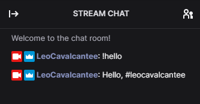

## Twitch Chatbot Example

### Requirements
- PHP >= 7.4
- Swoole >= 4.5
- Swoole IRC Client >= 0.x

#### Code

```php
Co\run(static function (): void {
    $logger = new Logger('Log');
    $logger->pushHandler(new StreamHandler('php://stdout', Logger::DEBUG));

    Client::create()
        ->setLogger($logger)
        ->connect('irc.chat.twitch.tv', 6667, false)
        ->pass('oauth:' . getenv('TWITCH_OAUTH_TOKEN'))
        ->nick('leocavalcantee')
        ->listen(new class implements ReplyHandlerInterface {
            public function onReply(Reply $reply, Client $client): void
            {
                if ($reply->text === "You are in a maze of twisty passages, all alike.") {
                    $client->join(['#leocavalcantee']);
                }

                if ($reply->text === '!hello') {
                    $client->privmsg(['#leocavalcantee'], "Hello, {$reply->nick}");
                }
            }
        });
});
```

#### Starting

```bash
TWITCH_OAUTH_TOKEN=<grab a token at https://twitchapps.com/tmi/> php examples/twitch-bot/bot.ph
```

#### Testing



##### Log
```text
[2020-10-13T21:22:28.831026-03:00] Log.INFO: Connected to irc.chat.twitch.tv at port 6667 [] []
[2020-10-13T21:22:28.895843-03:00] Log.DEBUG: PASS oauth:xxxxxxxxxxxxxxxxxxxxxxxxxxxxxx [] []
[2020-10-13T21:22:28.904568-03:00] Log.DEBUG: NICK leocavalcantee [] []
[2020-10-13T21:22:29.144101-03:00] Log.DEBUG: :tmi.twitch.tv 001 leocavalcantee :Welcome, GLHF! [] []
[2020-10-13T21:22:29.152914-03:00] Log.DEBUG: :tmi.twitch.tv 002 leocavalcantee :Your host is tmi.twitch.tv [] []
[2020-10-13T21:22:29.153044-03:00] Log.DEBUG: :tmi.twitch.tv 003 leocavalcantee :This server is rather new [] []
[2020-10-13T21:22:29.153144-03:00] Log.DEBUG: :tmi.twitch.tv 004 leocavalcantee :- [] []
[2020-10-13T21:22:29.153250-03:00] Log.DEBUG: :tmi.twitch.tv 375 leocavalcantee :- [] []
[2020-10-13T21:22:29.153345-03:00] Log.DEBUG: :tmi.twitch.tv 372 leocavalcantee :You are in a maze of twisty passages, all alike. [] []
[2020-10-13T21:22:29.168702-03:00] Log.DEBUG: JOIN #leocavalcantee [] []
[2020-10-13T21:22:29.168887-03:00] Log.DEBUG: :tmi.twitch.tv 376 leocavalcantee :> [] []
[2020-10-13T21:22:29.408534-03:00] Log.DEBUG: :leocavalcantee!leocavalcantee@leocavalcantee.tmi.twitch.tv JOIN #leocavalcantee [] []
[2020-10-13T21:22:29.408661-03:00] Log.DEBUG: :leocavalcantee.tmi.twitch.tv 353 leocavalcantee = #leocavalcantee :leocavalcantee [] []
[2020-10-13T21:22:29.408752-03:00] Log.DEBUG: :leocavalcantee.tmi.twitch.tv 366 leocavalcantee #leocavalcantee :End of /NAMES list [] []
[2020-10-13T21:22:37.326408-03:00] Log.DEBUG: :leocavalcantee!leocavalcantee@leocavalcantee.tmi.twitch.tv PRIVMSG #leocavalcantee :!hello [] []
[2020-10-13T21:22:37.337504-03:00] Log.DEBUG: PRIVMSG #leocavalcantee :Hello, #leocavalcantee [] []
```